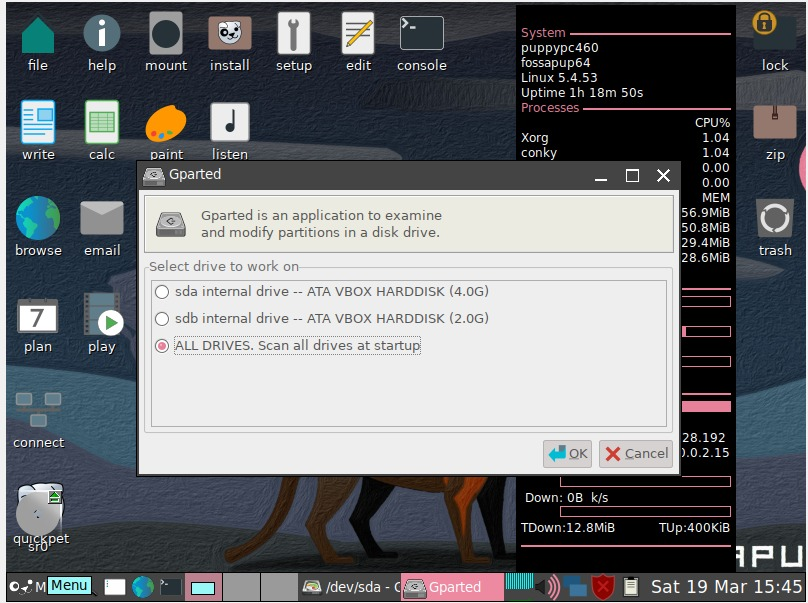

# FOSAAPUP
TUTORIAL DE COMO INTALAR FOSSAPUP

Creamos los discos(2) que vamos a utilizar con su respetivo almacenamintos

despues de crear el almacenamiento le damos en mostrar y nos sale la opcion Quick Setup

El idioma sale por defecto en ingles

Modificamos el idioma y la region el teclado lo dejamos en ingles

despues de modificar el idioma le damos ok, nos sale esta opcion 

La pasamos a la tercera opcion ya que es la que necesitamos y le damos OK
 

seguimos con el procedimiento y le damos  Restart x
 

continuamos con los pasos y ledamos en la x

esta es la ultima ventana emergente que sale solo se leda OK

La ventana Principal del programa tiene que salir asi

Para hacer la particion de los discos toca ir al menu y ledamos la opcion System y despues en GParted

cuando ya le damos los pasos que digimos anterior mente podemos mirar en la parte superior derecha los dos discos duros creados 

nos vamos al disco duro 1 en este caso seria el de 4gb

ledamos click derecho en donde sale las 4gb y ledamos New

para seguir con el proceso de particion del disco duro se nos abre la siguiente ventana

para que quede mas claro cuales son las opciones que tenemos que elejis en las casillas pusimos la siguiente imagen despues le damos add(agregar)

luegos vemos la particion que le hicimos al disco duro de 4gb

y esos seria para el disco numero 1 ya que el disco 2 que se le hizo particion el queda completo

#Fundacion o Empresa que estan atras de la distribucion de Fossapup

Fossapup es una distribución que selecciona aplicaciones de poco tamaño, pero que ofrezcan la funcionalidad que espera un usuario normal. Así, la versión 4.3.1, lanzada el 17 de octubre de 2009, pesa alrededor de 105 megas. La versión 5.2.5 (02/04/2011) es algo mayor, usando 130 megas. Permite elegir un navegador, tal como Chrome, Firefox, Opera o Seamonkey. También trae el procesador de textos Abiword, el programa de dibujo Mtpaint, hoja de cálculo Gnumeric, la interfaz de reproducción multimedia Gnome mplayer y visualmente se sigue manejando con el gestor de ventanas JWM aunque por defecto arranca con openbox. En su repositorio están disponibles para su descarga programas como: VLC media player, Libreoffice, Skype, Wine, Gimp, etc. A partir de la versión 5.3, las compilaciones oficiales de Puppy Linux solamente traen JWM, con la opción de instalar Openbox desde el PPM (siglas en inglés de Gestor de Paquetes de Fossapup).

#Ventajas del sistema Fossapup.

-Uso gratuito
-Los administradores se benefician de las libertades de gestión del sistema
-Soporta el trabajo cooperativo sin que los usuarios habituales puedan dañar el núcleo del programa
-Rara vez se ve amenazado por los cibercriminales
-Errores de seguridad poco habituales que se solucionan rápidamente
-Pocos requisitos de hardware
-Función remota integrada para el control a distancia

#Que entorno de escritorio viene incluido en el sistema Fossapup

Un entorno de escritorio proporciona una completa interfaz gráfica de usuario (GUI) para un sistema donde se agrupan una diversidad de clientes de El Sistema de Ventanas X escritos con un conjunto de herramientas Widget y un conjunto de bibliotecas comunes.

#Alguna ventaja del entorno Fossapup sobre los otros sistemas

La segunda y mayor ventaja es que existe la libertad de conocimiento y el trabajo cooperativo entre los usuarios, consiguiendo así un software más innovador. La tercera ventaja es que permite una rápida solución de errores ya que se puede acceder libremente al código fuente.

#El nombre del explorador de archivos de fossapup

-Haga clic en el botón Start (Inicio).
-En el Start Menu (Menú Inicio), haga clic en el icono File Explorer (Explorador de archivos).

#Alguna ventaja del entorno Fossapup sobre los otros sistemas

-Linux es muy robusto, estable y rápido: Ideal para servidores y aplicaciones distribuidas. A esto se añade que puede funcionar en máquinas sencillas: Linux puede correr servicios en un x86 a 200 MHz con calidad
-Linux es libre: Esto implica no sólo la gratuidad del software, sino también que Linux es modificable y que Linux tiene una gran cantidad de aplicaciones libres en Internet. Todo ello arropado por la inmensa documentación de Linux que puede encontrarse en la Red
-Linux ya no está restringido a personas con grandes conocimientos de informática: Los desarrolladores de Linux han hecho un gran esfuerzo por dotar al sistema de asistentes de configuración y ayuda, además de un sistema gráfico muy potente. Distribuciones Linux como Red Hat/Fedora tienen aplicaciones de configuración similares a las de Windows.

